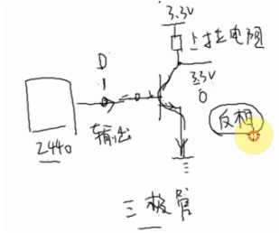
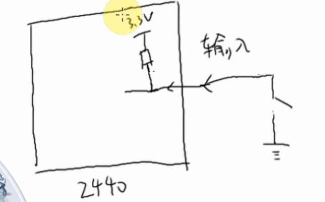
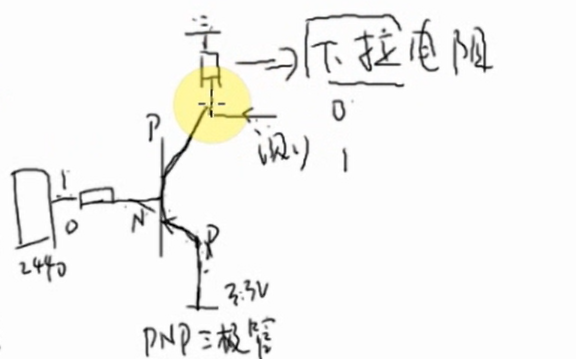
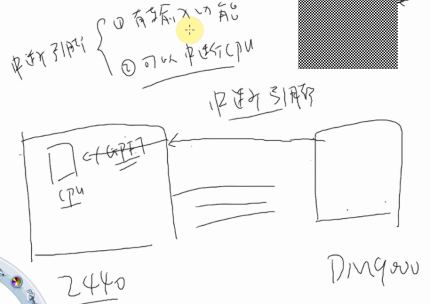
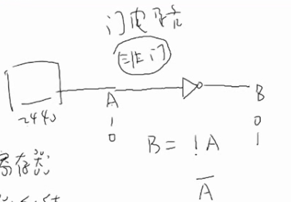
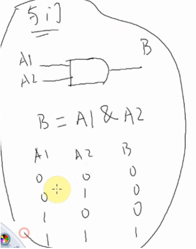
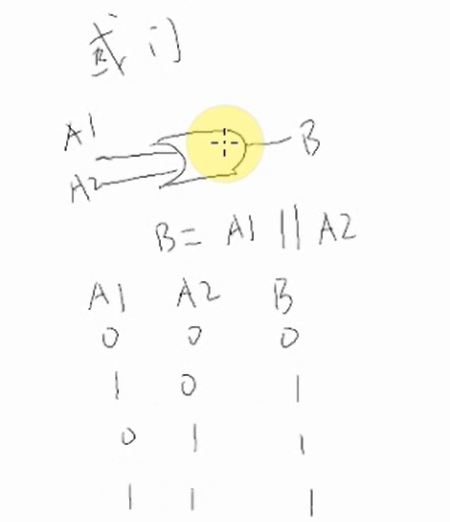
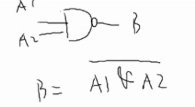
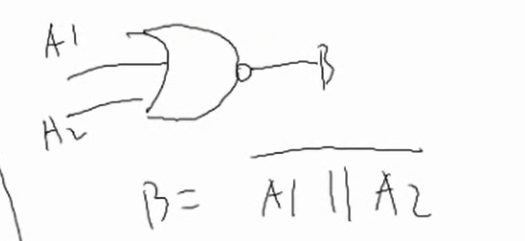

# 原理图分三大类
1. GPIO和门电路 : general peripheral input/output
    - 1.1 输入、输出引脚、上拉电阻、三极管
    - 1.2 与门、或门、非门
2. 协议类
    - 2.1 UART
    - 2.2 I2C
    - 2.3 SPI
    - 2.4 NAND K9F2G08U0M
    - 2.5 LCD
    a. 原理图：2440和外接的芯片引脚对接即可  
    b. 弄清楚接口的协议：数据怎么传输？各引脚怎么配合？  
    c. 设置时序：2440发出的各个信号，要让外接的芯片能反应得过来
        c.1 看2440手册弄清楚能设置哪些参数，这些参数的含义(以CLK为单位)
        c.2 看外设芯片手册，弄清楚这些参数的取值范围(以秒为单位)
        c.3 根据c.1,c.2计算2440的寄存器取值
3. 类似内存的接口
    - 3.1 NOR、SDRAM、网卡
    - 3.2 不同位宽外设的接线、访问过程
    - 3.3 怎么确定访问地址、 设置内存控制器
***
## 上下拉电阻和引脚
### 三极管NPN
P:正  

### 上拉电阻  

### 下拉电阻  

### 中断引脚  
1.有输入功能  
2.可以中断cpu  

***

## 门电路
### 非门  

### 与门  

### 或门  

### 与非门  

### 或非门  
