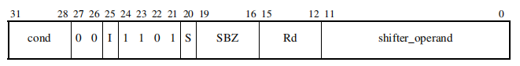

# 点亮一个LED灯
使用汇编点亮一个led    
```
.global __start

__start:
/* 点亮led:GPF4 */

/* 配置GPF4为输出引脚 */
/* 把0x100写到地址0x56000050 */
	ldr r1, =0x56000050
	ldr r0, =0x100 /* mov r0, #0x100 */
	str r0, [r1]

/* 配置GPF4为输出低电平 */
/* 把0写到地址0x56000054 */
	ldr r1, =0x56000054
	ldr r0, =0 /* mov r0, #0 */
	str r0, [r1]

/* 死循环 */
halt:
	b halt
```
***
# 汇编码与机器码
1. 修改.s汇编文件点亮另一个led灯
```
_start:
/* 点亮led:GPF5 */

/* 配置GPF5为输出引脚 */
/* 把0x400写到地址0x56000050 */
	ldr r1, =0x56000050
	ldr r0, =0x400 /* mov r0, #0x400 */
	str r0, [r1]

/* 配置GPF5为输出低电平 */
/* 把0写到地址0x56000054 */
	ldr r1, =0x56000054
	ldr r0, =0 /* mov r0, #0 */
	str r0, [r1]

/* 死循环 */
halt:
	b halt
```
2. 修改.bin二进制文件，点亮另一个灯  
- e3a00b01 	mov	r0, #1024	; 0x400
- 查看arm架构手册，找到mov指令机器码

- 0xe3a00b01 二进制：1110 0011  1010 0000  0000 1011  0000 0001
- bit说明：[24:21]:表示MOV指令 [15:12]:表示R0 [11:0]：表示0x400立即数 要修改的就是[11:0]这12bit
- 12bit拆分成高4位和低8位，高4位：rotate 低8位：immed_8
- 立即数 = immed_8循环右移(2*rotate)位,即：0x400 = 00000000 00000000 00000000 00000001循环右移22位
- 循环右移动22位：00000000  00000000  00000100  00000000 = 0x400
- 假如要点亮GPF6 [13:12]:设置为输出引脚01 ---立即数0x1000 = 1循环右移20位，即rotae要设置成:1010
- 使用工具HexEditor 将机器码0xe3a00b01修改成0xe3a00a01


***
# 进制 
十进制：int a = 17;  
二进制：int a = 0b10001;    
八进制：int a = 021;  
十六进制：int a = 0x11;    
***
# 字节序(大小端)
int a = 0x12345678;  
高地址----------->低地址  
小端：0x12 0x34 0x56 0x78  
大端：0x78 0x56 0x34 0x12  
思考：如何编写一段代码判断当前机器是大端还是小端？  
***
# 位操作
1. 移位  
左移：<<  
右移：>>
2. 取反  
~
3. 位与  
&  
4. 位或  
|  
***
# 置位操作
int a = 0x123;  
置位bit7 bit8  
int b = a | (1 << 7) | (1 << 8)
***
# 清位操作  
int a = 0x123;  
清位bit7 bit8  
int b = (a & \~(1 << 7)) & (\~(1 << 8))
***
# 用C语言点灯  

***
# 完善LED程序_编写按键程序  