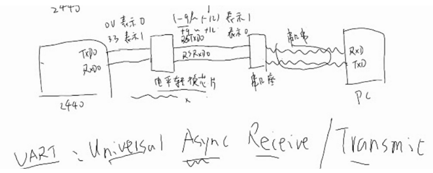
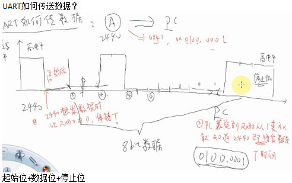

# 协议类
1. 你说的，别人能听懂   ---------双方约定信号的协议
2. 你的语速， 要让别人接受-------双方满足时序要求
***

什么是校验位？
奇偶校验(Parity Check)是一种校验代码传输正确性的方法。根据被传输的一组二进制代码的数位中“1”的个数是奇数或偶数来进行校验。采用奇数的称为奇校验，反之，称为偶校验。采用何种校验是事先规定好的。通常专门设置一个奇偶校验位，用它使这组代码中“1”的个数为奇数或偶数。若用奇校验，则当接收端收到这组代码时，校验“1”的个数是否为奇数，从而确定传输代码的正确性。

奇校验： 传输的数据 1 个数如果为偶数个，校验位会置为1，保证1的个数为奇数个
例：数据：11000000   校验：1
偶校验：传输的数据1个数为偶数个，校验位会置为0，保证1的个数为偶数个 
例：数据：11000000  校验：0
