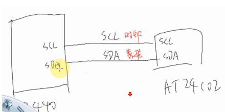
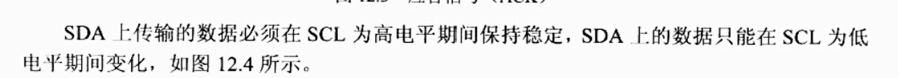
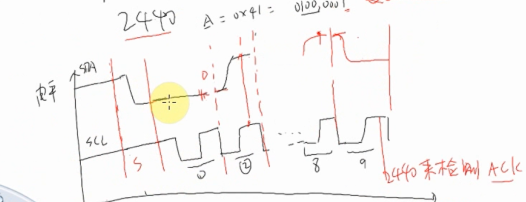
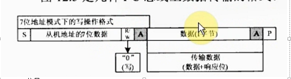
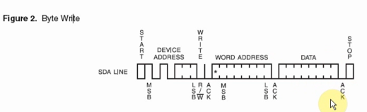

# 硬件原理图

## 数据传输时序  

如：要发送一个字符A, 16进制0x41 二进制0100 0001
S周期：检测到SDA下降沿，开发发送数据
1T：SDA保持低电平，产生脉冲后，SCL高电平期间去检测SDA状态为 0
2T：SDA保持低电平，产生脉冲后，SCL高电平期间去检测SDA状态为 1
.
.
.
.
8T：SDA保持低电平，产生脉冲后，SCL高电平期间去检测SDA状态为 1
最后2440来检测ACK，表示对方已经收到数据了

## I2C总线允许连接多个设备

S：strart信号
从机地址的7位数据：表示设备地址，最多可访问2的7次方，即128和设备
R/W：读或写  
A：表示ACK响应
数据1(字节)：表示传输方向
A: 表示ACK响应
P：停止信号

## I2C写

